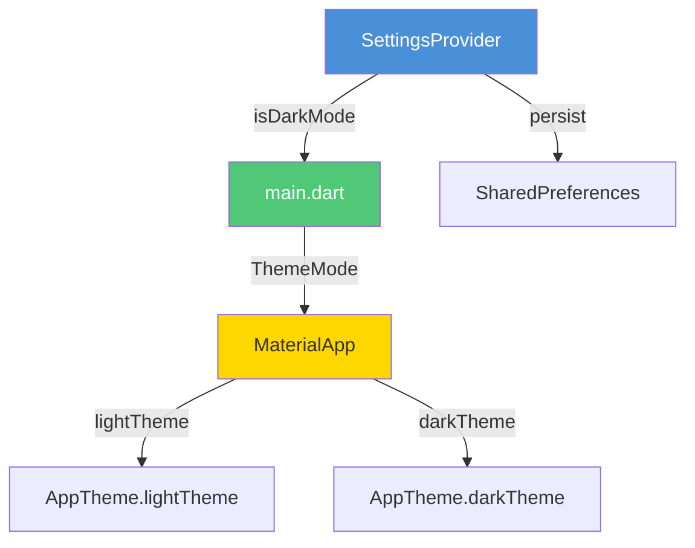
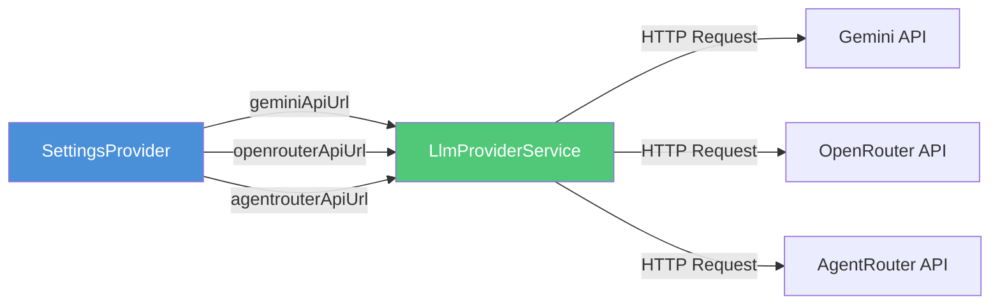

# Flutter App Enhancements Plan

## Overview
This document outlines the planned enhancements for the LittleMind AI Flutter app, covering theme improvements, API configuration fixes, and image support in responses.

---

## 1. Theme System Overhaul

### 1.1 Light Theme - Gender Neutral Kid-Friendly Colors

**Current Issues:**
- Uses purple/pink colors which are perceived as "girlish"
- Limited color palette

**New Color Palette:**
```
Primary:        #4A90D9 (Friendly Blue)
Secondary:      #50C878 (Emerald Green)
Accent:         #FFD700 (Golden Yellow)
Background:     #F0F8FF (Alice Blue - very light blue)
Card/Surface:   #FFFFFF (White)
User Bubble:    #87CEEB (Sky Blue)
Bot Bubble:     #E8F5E9 (Light Green)
Error:          #FF8A65 (Soft Coral)
Text Primary:   #2C3E50 (Dark Blue-Gray)
Text Secondary: #7F8C8D (Medium Gray)
```

### 1.2 Dark Theme Support

**Dark Theme Color Palette (based on #232D3F):**
```
Primary:        #5BA4E6 (Lighter Blue for dark bg)
Secondary:      #66D9A0 (Lighter Green for dark bg)
Accent:         #FFE44D (Brighter Yellow for dark bg)
Background:     #232D3F (Dark Navy - user specified)
Surface:        #2D3A4F (Slightly lighter navy)
Card:           #344258 (Card background)
User Bubble:    #3D5A80 (Muted Blue)
Bot Bubble:     #2E4A3E (Muted Green)
Error:          #E57373 (Soft Red)
Text Primary:   #E8E8E8 (Light Gray)
Text Secondary: #A0AAB5 (Medium Light Gray)
```

### 1.3 Theme Architecture



### 1.4 Files to Modify

| File | Changes |
|------|---------|
| `lib/theme/app_theme.dart` | Add complete light and dark themes |
| `lib/providers/settings_provider.dart` | Add isDarkMode state + persistence |
| `lib/main.dart` | Add theme switching logic |
| `lib/screens/chat_screen.dart` | Update colors, add theme toggle in settings |
| `lib/widgets/message_bubble.dart` | Update bubble colors for both themes |
| `lib/screens/llm_provider_settings_screen.dart` | Update to use theme colors |

---

## 2. Fix Agent Router API URL

### 2.1 Current Issue
- URL is `https://agentrouter.ai/api/v1/chat/completions`
- Should be `https://agentrouter.org/v1`

### 2.2 Changes Required

| File | Line | Change |
|------|------|--------|
| `lib/config/app_config.dart` | 15-16 | Update `defaultAgentRouterUrl` to `https://agentrouter.org/v1` |

---

## 3. Add API URL Option for All LLM Providers

### 3.1 Current State
- Ollama: Has URL + Model + API Key fields
- Gemini: Has API Key + Model (NO URL field)
- Custom: Has URL + API Key + Model
- OpenRouter: Has API Key + Model (NO URL field)
- AgentRouter: Has API Key + Model (NO URL field)

### 3.2 Required Changes

**Add URL fields for:**
- Gemini API
- OpenRouter API
- AgentRouter API

### 3.3 Data Flow



### 3.4 Files to Modify

| File | Changes |
|------|---------|
| `lib/config/app_config.dart` | Add default URLs + shared prefs keys |
| `lib/providers/settings_provider.dart` | Add new fields + persistence |
| `lib/screens/llm_provider_settings_screen.dart` | Add URL input fields |
| `lib/services/llm_provider_service.dart` | Use configurable URLs |

---

## 4. Add Supporting Images in LLM Query Answers

### 4.1 Approach
Since LLMs can return markdown-formatted responses, we can instruct them to include image URLs in their responses using markdown image syntax ``. The `flutter_markdown_plus` package already supports rendering images in markdown.

### 4.2 Implementation Strategy

**Prompt Updates:**
- Modify system prompts to request relevant image URLs
- Instruct LLM to include 1-2 supporting images using markdown format
- Specify child-friendly, safe image sources

**Response Screen Updates:**
- The `MarkdownBody` widget in `message_bubble.dart` already supports images
- Add `onImageBuilder` or `imageBuilder` callback for custom image rendering
- Add loading state for images
- Add error handling for broken image URLs

### 4.3 Updated Prompt Template Example

```json
{
  "system_prompt": "...existing prompt...\n\nSUPPORTING IMAGES:\n- Include 1-2 relevant image URLs using markdown format: \n- Use child-friendly, educational images\n- Images should support the explanation\n- Use safe image sources (e.g., Wikimedia Commons, Unsplash)",
  "user_message": "...existing prompt..."
}
```

### 4.4 Files to Modify

| File | Changes |
|------|---------|
| `assets/prompts/story.json` | Add image instructions to system prompt |
| `assets/prompts/emotion.json` | Add image instructions to system prompt |
| `assets/prompts/parent.json` | Add image instructions to system prompt |
| `lib/widgets/message_bubble.dart` | Add image builder support |
| `lib/services/llm_provider_service.dart` | Update prompt building if needed |

### 4.5 Message Bubble Image Support

```dart
MarkdownBody(
  data: text,
  imageBuilder: (uri, title, alt) {
    return Image.network(
      uri.toString(),
      loadingBuilder: (context, child, loadingProgress) {
        if (loadingProgress == null) return child;
        return CircularProgressIndicator();
      },
      errorBuilder: (context, error, stackTrace) {
        return Icon(Icons.broken_image);
      },
    );
  },
  // ... existing stylesheet
)
```

---

## Implementation Order

1. **Theme System** (highest priority, affects all UI)
   - 1.1 Update light theme colors
   - 1.2 Add dark theme
   - 1.3 Add theme toggle
   - 1.4 Test both themes

2. **Agent Router URL Fix** (quick fix)
   - 2.1 Update URL constant

3. **API URL Configuration** (settings enhancement)
   - 3.1 Add fields to SettingsProvider
   - 3.2 Add UI in settings screen
   - 3.3 Update service to use configurable URLs

4. **Image Support** (response enhancement)
   - 4.1 Update prompts
   - 4.2 Update message bubble for images
   - 4.3 Test image rendering

---

## Risk Assessment

| Enhancement | Risk Level | Notes |
|-------------|------------|-------|
| Theme System | Low | Purely cosmetic, no data loss |
| Agent Router URL | Low | Single constant change |
| API URL Config | Low | Additive changes, backward compatible |
| Image Support | Medium | Depends on LLM returning valid URLs |
